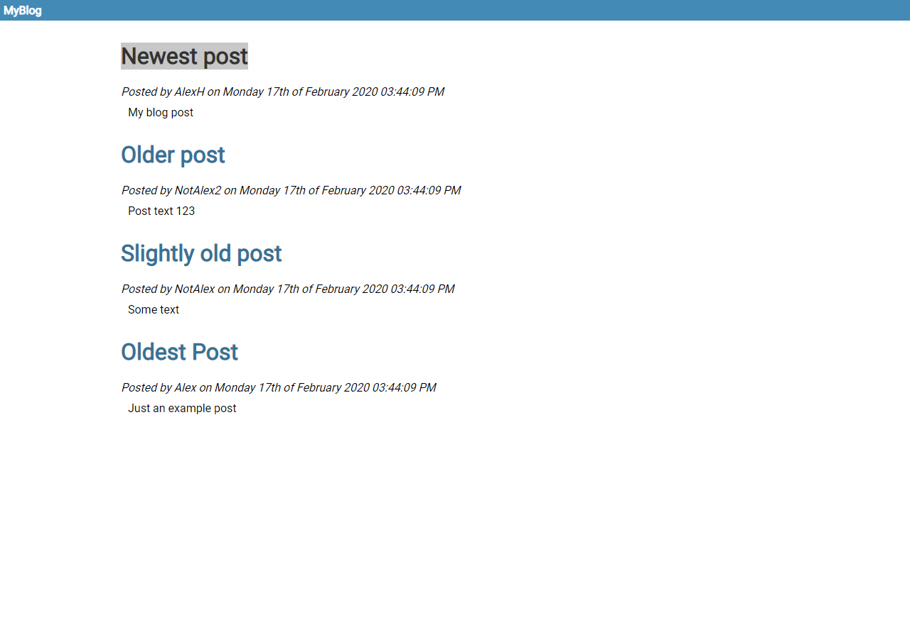

### Overview

This is an example CMS skeleton that I produced in an hour as a coding project. It uses HTML, PHP, CSS (via SASS) and MySQL.

It was done as a project to show what I could knock out as a simple prototype in just an hour and to help test new concepts for my custom CMS that I am working on.

It needs some cleanup work and is far from the best quality of code, but again, it was done in less than an hour as a challenge and contains a simple module, theme and template system from scratch.

# Screenshot

